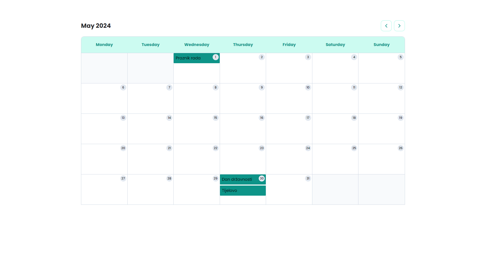

## Task Description:

As part of my Junior Frontend Developer (React) task for b2match, I have created a calendar application that connects to a [Public API](https://www.openholidaysapi.org/en/api/) containing time data. The goal of this project is to display fetched events in a calendar view.

## Key Features:

* Allows users to switch between months within the calendar.
* Displays only the dates within the selected month.
* Shows relevant data from the API within each day's cell.
* Aggregates multiple events within a single day, if applicable.
* Utilizes a DateTime library (date-fns) for handling date-related operations.

* Supports dynamic URL-based navigation for selecting a specific year and month (e.g., /2022/05/01).
* Enables users to view additional details upon clicking on an event.

## How to Run

Follow these steps to run the project locally:

1. Clone this repository to your local machine
2. Install the project dependencies: `npm install`
3. Start the development server: `npm run dev`

---
  
Feel free to explore the application and provide feedback or improvements. Enjoy!
